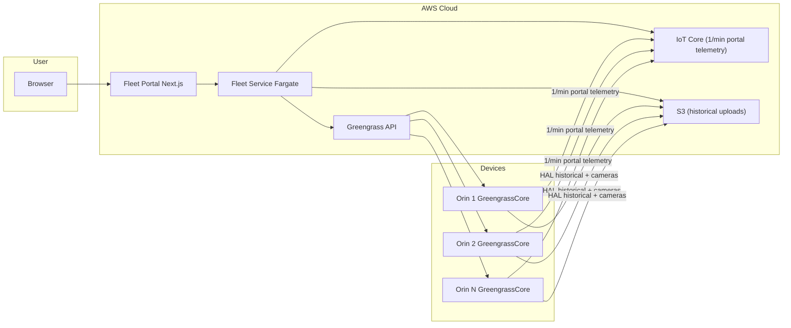
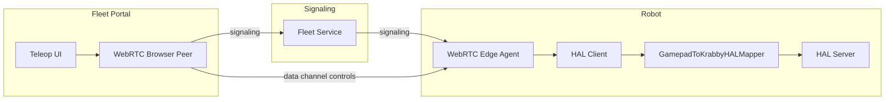

# Milestone 10 – Fleet Manager (Overview)

## Grant Overview

Build a **fleet manager** for Krab robots so we can operate and maintain multiple Seeed Robotics J4012 Orin Jetsons (and scale to many more) from a single web portal. The fleet manager must support:

- **Deploying and updating** the Krabby application via AWS IoT Greengrass (pull images from ECR, deploy to registered devices, support custom image tags and revert).
- **Viewing portal telemetry** (1/min health, IMU/pose, power, red flags) and **opening a WebRTC teleop session** to any robot from the same portal (live streams + control; M7 teleop UI absorbed here).

This milestone extends the M7 vision/teleop work by moving the teleop UI into the fleet manager and adding device management, OTA updates, and centralized telemetry. M7 remains the source of truth for HAL observations and sensor list, WebRTC streaming and control protocol, and the `InputController` command struct; M10 integrates that behavior into the fleet portal.

## Why is this Important?

- **Single pane for fleet operations:** List devices, see status and telemetry, open teleop, and deploy new images from one place.
- **OTA via Greengrass:** Deploy and revert Krabby Docker images to devices without physical access; support custom tags (e.g. `image-<handle>-<date>`) for rolling out builds.
- **Telemetry and teleop in one place:** Operators click into a device to see live telemetry and start a WebRTC session without switching tools.
- **Regression gate:** End-to-end hardware-in-the-loop deployment (githook → Greengrass → test harness Orin → joint move → calibration check) proves the fleet manager can deploy images and gives a pass/fail for mainline Krabby image on real hardware.

## Target Devices and Scale

- **Primary device:** Seeed Robotics J4012 Orin Jetson (Jetpack 6 and 7 supported).
- **In principle:** Any device capable of running Greengrass and Docker on an NVIDIA platform.
- **Scale:** 2–10 robots for initial validation; architecture must support scaling to hundreds or thousands of devices.

## Tasks

Total: ~1 month (one developer part-time with AI assistance), ~1 week per task (~20–30 hours each).

| Task | Summary | Doc |
|------|---------|-----|
| **Task 1** | Publish **krabby-bootstrap** wheel to PyPI (GitHub tag workflow); installable on Orin; `krabby-bootstrap` command uses AWS creds to talk to Greengrass and auto-fetch mainline image (optional `--image` for custom image). ~1 day. | [TASK-1-GREENGRASS-SETUP.md](TASK-1-GREENGRASS-SETUP.md) |
| **Task 2** | Front-end web portal (Next.js) and fleet service on Fargate; list devices, telemetry from robots to S3 per robot, ECR + githook for fleet service deploy. | [TASK-2-FLEET-PORTAL-SERVICE.md](TASK-2-FLEET-PORTAL-SERVICE.md) |
| **Task 3** | Teleop from portal: open WebRTC session per device, 2-robot demo, robot pose + cameras, Bluetooth gamepad and in-browser control. | [TASK-3-TELEOP-INTEGRATION.md](TASK-3-TELEOP-INTEGRATION.md) |
| **Task 4** | E2E hardware-in-the-loop: githook deploys new image to test harness Orin, automated joint move and calibration screen check (~1–2"). | [TASK-4-E2E-HARDWARE-LOOP.md](TASK-4-E2E-HARDWARE-LOOP.md) |

## Dependencies

- **M7 complete:** HAL observations and sensor list, WebRTC streaming agent, control protocol (`InputController` command struct), and test server app behavior. M10 absorbs the test server app into the fleet portal; the WebRTC agent and protocol stay as in M7.
- **ECR:** Krabby application images available in ECR (standard image built by krabby-research Makefile); fleet service image repo for Fargate.
- **Greengrass Core:** Installed and provisioned on at least one Orin (J4012) for Task 1; test harness Orin for Task 4. Task 1 delivers the **krabby-bootstrap** PyPI package: installable on any Orin (`pip install krabby-bootstrap`); the **krabby-bootstrap** command uses default AWS creds to talk to Greengrass and auto-fetch the mainline image (optional `--image` for a custom ECR image).
- **AWS account:** Krabby Co (krabby-company, account 6329-1496-1627). Fargate cluster/service, S3 bucket(s), Greengrass thing groups, IAM roles as needed.
- **Infra as code:** CDK for repeatable infra (Fargate, ECR, S3, Greengrass, IAM). Document what must exist before starting (Greengrass Core on Orin, ECR repos, Fargate cluster).

## Information

- **App image:** The Krabby application runs as a Greengrass component in a Docker container. Use **existing** Krabby Docker images from ECR—no special Greengrass base image inside the app. The app image is the standard image built in krabby-research by the core Makefile. It may contain: HAL server/clients, model, ZMQ bus, teleop/WebRTC agent, and an AWS IoT client for portal telemetry and commands (MQTT).
- **Stack:** AWS IoT Greengrass v2, ECR, Fargate, S3; Next.js for portal; WebRTC (M7 protocol) for teleop.

### Telemetry and data channels (three distinct paths)

| Channel | Purpose | When / rate | Content |
|--------|---------|-------------|---------|
| **AWS IoT** | Portal telemetry (device list and detail view) | **Once per minute** from each robot | Basic health: krab health, IMU/pose, power, and any major red flags. Fleet service reads device shadow; portal displays this for “at a glance” status. |
| **Teleop / WebRTC** | Live telemetry during an active session | **Only while robot is attached** via WebRTC | Live camera/radar streams and live pose (joint state) over the WebRTC connection. No live streams when no teleop session is open. |
| **HAL client → S3** | Historical data | Recording / batch upload | Historical telemetry and camera streams (e.g. ROSBAG/mcap) to S3 for replay, training, or debugging. |

M7 observations feed all three: IoT = small subset; WebRTC = live streams + pose during teleop only; HAL client = full set to S3.

## Security

- **Portal auth:** Use Cognito for authentication and authorization so the portal (including teleop) can be hosted on the public web with sign-in; teleop and device access restricted to authenticated users.
- **Device credentials:** Greengrass and IoT credentials are provisioned on the device and used by the fleet service/backend only; they are **not** exposed to the front end. The browser talks to the fleet service; the fleet service provides WebRTC signaling and talks to Greengrass/IoT/S3.

## Repos and Artifacts

- **Where fleet manager code lives:** `krabby-home/fleet`. Greengrass component definitions, fleet service, and portal code live under `krabby-home/fleet` and are versioned together so a single commit or tag can drive both “deploy fleet service” and “deploy app image to devices.”
- **Deliverables:** [OVERVIEW.md](https://github.com/flliver/patina-foundation-grants/blob/main/grants/Krabby-Uno/Milestone10-Fleet-Manager/OVERVIEW.md) (this file) and TASK-1 through TASK-4 in [Milestone10-Fleet-Manager on GitHub](https://github.com/flliver/patina-foundation-grants/tree/main/grants/Krabby-Uno/Milestone10-Fleet-Manager); milestone contract (ICA) in [krabby-contracts/milestones/M10/M10.md](https://github.com/flliver/krabby-contracts/blob/main/milestones/M10/M10.md); implementation in `krabby-home/fleet` with paths documented in each task; standardized Gastown setup with M10 rig and committed beads DB in **krabby-gastown** (see Gastown section below).

## Gastown

This milestone is run as a **Gastown rig** with a standardized setup committed so the CEO can pull the central repo and get started with the committed beads. See [Gastown setup in krabby-contracts](https://github.com/flliver/krabby-contracts/blob/main/gastown/OVERVIEW.md) for the overall Gastown setup, how to commit the beads DB and rig to the **krabby-gastown** repo, and the CEO workflow.

- **Acceptance:** A standardized Gastown setup for M10 is committed in the **krabby-gastown** repo, with a **rig for this project** and the **beads DB** (or export) committed so that when the contract is finished, the CEO can clone krabby-gastown and get started with this rig using the already committed beads.
- **Crew for this rig:**

| Agent | Role | Responsibilities |
|-------|------|------------------|
| **Shobanana** | Front-end dev | Static page + webserver (portal UI, Next.js, fleet portal front end). |
| **Boooooobby** | Fleet management dev | Greengrass, IoT, device management, 1/min telemetry, fleet service backend. |
| **TeleTubbie** | Teleop dev | Integrates teleop from M7/krabby-research: WebRTC signaling, STUN/TURN, 2-robot teleop. |
| **Arturo** | Project lead | Ensures every commit keeps CI/CD running for the two test robots; E2E hardware-in-the-loop, githook, pass/fail pipeline. |

## FAQ

- **Where does the fleet manager code live?**  
  `krabby-home/fleet` (portal, fleet service, component definitions).

- **How does revert work after a bad deploy?**  
  Create a new Greengrass deployment that points the Krabby component back to the previous image revision (previous ECR tag). Deployments must use `failureHandlingPolicy: ROLLBACK` so Greengrass automatically reverts if the component fails to start or reports failure via IPC. Document in TASK-1.

- **What telemetry comes from M7?**  
  See the **Telemetry and data channels** table above. M7 observations (M7 OVERVIEW Task 3) feed IoT (1/min subset), WebRTC (live during teleop), and HAL→S3 (historical).

- **How does teleop connect from the portal?**  
  User clicks “Teleop” for a device. The fleet service provides WebRTC signaling so the browser can establish a connection to the WebRTC agent running on that robot (same agent as in M7). Streams and control use the M7 protocol (data channel, same command struct as `InputController`). Device credentials stay server-side.

- **How does the fleet service create the P2P connection when both browser and robot are behind NAT?**  
  **Signaling only** goes through the fleet service (and AWS IoT to reach the robot). The browser talks to the fleet service over HTTPS/WebSocket. The robot cannot be reached directly by the browser, so the fleet service delivers signaling (SDP offer/answer, ICE candidates) to the robot via **AWS IoT**: e.g. publish to a topic the robot subscribes to (e.g. `teleop/{thingName}/signaling/in`), and the robot publishes its SDP/ICE to a topic the fleet service reads and forwards to the browser. So IoT is used only to **get signaling to the robot**; no video or control data goes over IoT.  
  **The actual media and data channel** use WebRTC **ICE** (STUN/TURN). Both peers exchange ICE candidates via the signaling path. They use a **STUN** server (public) to discover their public IP:port; often that is enough for a direct peer-to-peer connection even with both behind NAT. If direct P2P fails (e.g. symmetric NAT), a **TURN** server relays media. So the “P2P” connection is built by WebRTC/ICE on the internet; the fleet service and IoT only relay signaling. Document in Task 3: signaling path (fleet service + IoT topics), and use of STUN (and TURN if required for your networks).

- **Do I need a special Docker image for the robot app?**  
  No. Use the existing Krabby image from ECR. Greengrass runs it as a container via the Docker Application Manager; no Greengrass SDK or base image is required inside the app image.

- **How do I deploy my own custom image (e.g. my branch or tag)?**  
  Push your image to ECR with a tag (e.g. `image-<handle>-<date>`), then run `krabby-bootstrap --image <ECR-uri-or-tag>` so the CLI creates a Greengrass deployment with that image. Task 1 documents the flow.

- **Who publishes the 1/min portal telemetry from the robot?**  
  The robot-side publisher (HAL CLIENT) that updates device shadow is part of the krabby-bootstrap / fleet onboarding path; the payload schema and path are documented in Task 2. The Krabby app image can also publish if desired; the contract (schema, rate) is defined in Task 2.

- **Where do I find M7 behavior (WebRTC agent, control protocol, observations)?**  
  M7 OVERVIEW and tasks live in `krabby-contracts/milestones/M7/`. Use those for the sensor list, streaming agent, `InputController` command struct, and observation schema; M10 reuses that protocol in the fleet portal. That code will exist in krabby-research and should be complete and usable as is (ping dev for any fixes/improvements or fix yourself if it's simple).

- **Do I need two physical robots for the Task 3 “2-robot” demo?**  
  Yes. Acceptance requires two concurrent teleop sessions to two different devices (two robots), both controllable from the same portal to show multi-device support.

- **What about Cognito: invite-only or public sign-up?**  
  Use Cognito so the portal can be on the public web; document in Task 2 whether the user pool is invite-only, sign-up-with-verification, or federation (e.g. Google). Restrict teleop and device list to authenticated users.

- **What if a device is offline?**  
  Device list comes from Greengrass; offline devices still appear but may show last-known state. Telemetry (device shadow) may be stale; teleop will not connect until the device is online. Document in Task 2 how the portal displays offline or unreachable devices.

## Architecture Diagrams

### Fleet management flow

### Teleop flow (M7 protocol, integrated in portal)

