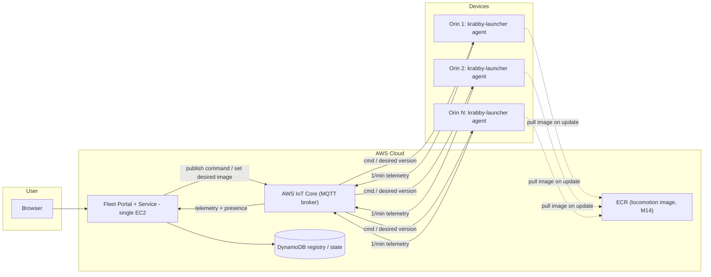
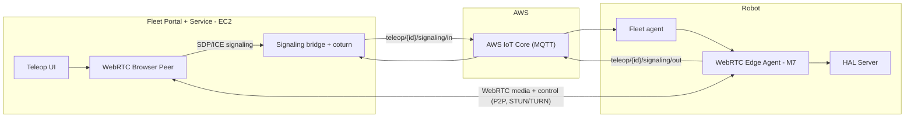

# Milestone 10 – Fleet Manager (Overview)

## Grant Overview

Build a **fleet manager** for Krab robots so we can operate and maintain many Seeed Robotics J4012 Orin Jetsons from a single web portal. The fleet manager is built on **one always-on internet channel per krab — AWS IoT Core (MQTT)** — and must support:

- **Onboarding:** a fresh Orin runs `krabby enroll` once (a `krabby-launcher` subcommand); it provisions the device's AWS IoT identity (X.509 cert), enables `krabby agent` (the always-on MQTT client), and **auto-connects** to AWS IoT Core. From then on the device is reachable and reports in.
- **Reach any device:** the fleet service can publish a command to **any registered device** over its MQTT command topic, and each device publishes telemetry back. No SSH, no VPN, no per-device public IP.
- **Web portal:** list devices, see per-device telemetry and status, send commands, and **open a WebRTC teleop session** to any robot (live streams + control; M7 teleop UI absorbed here).
- **Staged OTA:** push an image to a **test krab → validate → one canary krab → the rest of the fleet**, with a pass/fail gate between stages. Devices **pull** the image from ECR using the M14 launcher; the fleet manager only sets the desired version and rings the doorbell.

This milestone extends the M7 vision/teleop work by moving the teleop UI into the fleet manager and adding device onboarding, a central control plane, telemetry, and staged updates. M7 remains the source of truth for HAL observations and sensor list, the WebRTC streaming and control protocol, and the `InputController` command struct; M10 integrates that behavior into the fleet portal and moves teleop's internet **signaling onto the same MQTT channel** used for fleet management.

## Why is this Important?

- **Single pane for fleet operations:** list devices, see status and telemetry, send commands, open teleop, and roll out new images from one place.
- **Stupid-simple, robust transport:** every krab holds one outbound TLS/MQTT connection to a managed broker. The broker pushes commands back down that connection — the modern, managed equivalent of the old "reverse tunnel to a bastion," with NAT traversal and reconnect handled for us and nothing to self-host for the broker itself.
- **Telemetry and teleop in one place:** operators click into a device to see live telemetry and start a WebRTC session without switching tools, over the same channel the fleet uses.
- **Safe rollouts:** an image proves itself on a bench/test krab and one canary before it touches the fleet; a bad image never reaches all robots at once.

## Target Devices and Scale

- **Primary device:** Seeed Robotics J4012 Orin Jetson (Jetpack 6 and 7 supported).
- **In principle:** any Linux device that can run the M14 `krabby-launcher` stack (Docker + an MQTT client).
- **Scale:** 2–10 robots for initial validation; AWS IoT Core scales to thousands of devices without re-architecting.

## Tasks

Total: ~1 month (one developer part-time with AI assistance), ~1 week per task (~20–30 hours each). Tasks map directly to the four capabilities above.

| Task | Summary | Doc |
|------|---------|-----|
| **Task 1** | **Control plane + onboarding.** Stand up AWS IoT Core (thing types, thing groups/cohorts, policies, topic scheme, optional shadow) via CDK. Extend **`krabby-launcher`** with `krabby enroll` (provisions the device's IoT identity: X.509 cert + thing + policy + cohort) and `krabby agent` (the always-on MQTT client: telemetry + command + update + teleop-signaling). Devices land in a DynamoDB registry. | [TASK-1-CONTROL-PLANE-AND-ONBOARDING.md](TASK-1-CONTROL-PLANE-AND-ONBOARDING.md) |
| **Task 2** | **Fleet service + web portal.** Fleet service on a single EC2 (MQTT subscriber, REST API, presence → DDB). Next.js portal: device list (online/last-seen/version/cohort), device detail (1/min telemetry), send command. Cognito auth. | [TASK-2-FLEET-PORTAL-SERVICE.md](TASK-2-FLEET-PORTAL-SERVICE.md) |
| **Task 3** | **Teleop over the shared channel.** WebRTC teleop from the portal, signaling bridged through IoT topics (one mechanism), coturn (TURN) on the EC2, 2-robot demo. Reuses the M7 agent and protocol. | [TASK-3-TELEOP-INTEGRATION.md](TASK-3-TELEOP-INTEGRATION.md) |
| **Task 4** | **Staged OTA + E2E validate gate.** Set desired image per cohort; device launcher (M14) pulls from ECR; promote **test harness → canary → fleet** only after an automated hardware validate test passes at each stage. Old E2E hardware loop = cohort 0. | [TASK-4-STAGED-ROLLOUT-AND-E2E.md](TASK-4-STAGED-ROLLOUT-AND-E2E.md) |

## Dependencies

- **M7 complete:** HAL observations and sensor list, WebRTC streaming agent, control protocol (`InputController` command struct), and the reference signaling flow. M10 reuses the M7 WebRTC agent and protocol; it adds an MQTT signaling transport alongside M7's existing WebSocket path (which remains valid for LAN/direct use).
- **M14 complete (the "launcher"):** the `krabby-launcher` package — which provides the `krabby` command (`krabby install` / `update` / `run`) — plus `krabby-firmware`, and the `krabby-bench` poll-and-validate pattern. M10's OTA does **not** re-implement update delivery; it drives M14's pull-based updater from the cloud. ECR locomotion image and public S3 firmware store come from M14.
- **AWS account:** Krabby Co (krabby-company, account 6329-1496-1627). **AWS IoT Core** (things, policies, topic rules, optionally shadows + IoT Jobs), **DynamoDB** (device registry/state), one **EC2** instance (fleet service + portal + coturn), **ECR/S3** (from M14), Cognito, IAM.
- **Infra as code:** CDK for repeatable infra (IoT Core resources, DynamoDB, EC2, Cognito, IAM, security groups). Document what must exist before starting.

## Information

- **App image:** the Krabby application runs as a Docker container from ECR — the **standard M14 production image**, installed/updated by the `krabby` command (`krabby-launcher`). No special base image. It contains: HAL server/clients, model, ZMQ bus, and the teleop/WebRTC agent.
- **Agent:** `krabby-launcher` running in agent mode (`krabby agent`) as a systemd service, owning the device's MQTT connection. It (1) publishes 1/min telemetry, (2) handles commands incl. "update to desired image" by invoking `krabby update`, and (3) carries teleop signaling to the M7 WebRTC agent (via local IPC/ZMQ or by the app subscribing directly — implementer's choice, documented in Task 1).
- **Stack:** AWS IoT Core (MQTT), DynamoDB, EC2, ECR/S3 (M14), Cognito; Next.js for the portal; WebRTC (M7 protocol) for teleop media; coturn for TURN.

### Telemetry and data channels (three distinct paths)

| Channel | Purpose | When / rate | Content |
|--------|---------|-------------|---------|
| **AWS IoT Core (MQTT)** | Portal telemetry + commands (device list and detail view) | **Once per minute** up from each robot; commands down on demand | Basic health: krab health, IMU/pose, power, major red flags. Robot publishes to `krab/{id}/telemetry`; fleet service writes latest to DynamoDB for the portal. Commands/desired-version go down to the device. |
| **Teleop / WebRTC** | Live telemetry during an active session | **Only while robot is attached** via WebRTC | Live camera/radar streams and live pose over the peer-to-peer WebRTC connection. Signaling for that connection rides MQTT; media does not. No live streams when no teleop session is open. |
| **HAL client → S3** | Historical data | Recording / batch upload | Historical telemetry and camera streams (e.g. ROSBAG/mcap) to S3 for replay, training, or debugging. |

M7 observations feed all three: MQTT = small 1/min subset; WebRTC = live streams + pose during teleop only; HAL client = full set to S3.

## Security

- **Portal auth:** Cognito for authentication/authorization so the portal (including teleop) can be hosted on the public web with sign-in; teleop and device access restricted to authenticated users.
- **Device identity:** each device gets a unique **X.509 certificate** and a scoped **AWS IoT policy** (provisioned by `krabby enroll`) that allows it to connect only as its own thing and publish/subscribe only on its own topics (`krab/{id}/...`, `teleop/{id}/...`). A compromised device cannot read or command other devices. Device credentials live on the device and are used by the fleet service/backend only; they are **not** exposed to the front end. The browser talks to the fleet service; the fleet service talks to IoT Core / DynamoDB / S3.

## Repos and Artifacts

- **Where fleet manager code lives:** `krabby-home/fleet` holds the fleet service, portal, CDK infra, and DynamoDB. The device-side `krabby enroll` + `krabby agent` capabilities are added to the **`krabby-launcher`** package in `krabby-research` (extending M14's tool), versioned so a single commit/tag can drive both "deploy fleet service" and "set desired image for a cohort."
- **Deliverables:** [OVERVIEW.md](https://github.com/flliver/patina-foundation-grants/blob/main/grants/Krabby-Uno/Milestone10-Fleet-Manager/OVERVIEW.md) (this file) and TASK-1 through TASK-4 in [Milestone10-Fleet-Manager on GitHub](https://github.com/flliver/patina-foundation-grants/tree/main/grants/Krabby-Uno/Milestone10-Fleet-Manager); milestone contract (ICA) in [krabby-contracts/milestones/M10/M10.md](https://github.com/flliver/krabby-contracts/blob/main/milestones/M10/M10.md); implementation in `krabby-home/fleet` with paths documented in each task; standardized Gastown setup with M10 rig and committed beads DB in **krabby-gastown** (see Gastown section below).

## Gastown

This milestone is run as a **Gastown rig** with a standardized setup committed so the CEO can pull the central repo and get started with the committed beads. See [Gastown setup in krabby-contracts](https://github.com/flliver/krabby-contracts/blob/main/gastown/OVERVIEW.md) for the overall Gastown setup, how to commit the beads DB and rig to the **krabby-gastown** repo, and the CEO workflow.

- **Acceptance:** A standardized Gastown setup for M10 is committed in the **krabby-gastown** repo, with a **rig for this project** and the **beads DB** (or export) committed so that when the contract is finished, the CEO can clone krabby-gastown and get started with this rig using the already committed beads.
- **Crew for this rig:**

| Agent | Role | Responsibilities |
|-------|------|------------------|
| **Shobanana** | Front-end dev | Portal UI (Next.js): device list/detail, command UI, teleop view. |
| **Boooooobby** | Fleet/control-plane dev | AWS IoT Core (MQTT) setup, device identity/policies, `krabby enroll` + `krabby agent` (in krabby-launcher), 1/min telemetry, fleet service backend, DynamoDB registry. |
| **TeleTubbie** | Teleop dev | Teleop from M7/krabby-research: WebRTC over MQTT signaling, STUN/coturn, 2-robot teleop. |
| **Arturo** | Project lead | Staged OTA + E2E hardware-in-the-loop: cohorts, validate gate, test harness → canary → fleet promotion; keeps CI green for the test robots. |

## FAQ

- **What changed from the original (Greengrass-based) M10?**
  The original M10 was built around **AWS IoT Greengrass** and a `krabby-bootstrap` that used Greengrass deployments to push images to devices. **M14 (Krabby Installable Stack) has since absorbed that job:** the `krabby` command (from the **`krabby-launcher`** package) installs/updates the locomotion image from **ECR** and `krabby-firmware` flashes MCUs from **public S3**, all **pull-based** (poll a digest, pull when it changes — see `krabby-bench`). That on-device updater — the "krabby-launcher" — is now M14's deliverable, **not M10's**. So M10 is restructured:
  - **Greengrass is removed entirely.** No Greengrass Core, no component definitions, no Greengrass deployments. The heavy edge-component runtime bought us nothing that "pull from ECR + an MQTT doorbell" doesn't.
  - **Onboarding folds into `krabby-launcher`.** There is no separate `krabby-bootstrap`; the launcher gains `krabby enroll` (provision IoT identity) and `krabby agent` (the always-on MQTT client). It still doesn't push images — `krabby update` pulls from ECR.
  - **One internet channel.** Teleop (M7) and fleet management share a single per-device MQTT connection to AWS IoT Core; teleop **signaling** rides MQTT (`teleop/{thingName}/signaling/in|out`) and WebRTC media stays peer-to-peer. We do not run two parallel mechanisms for devices to talk to the cloud.
  - **OTA is pull + staged.** The fleet manager sets a desired image per cohort and the device's M14 launcher pulls it; rollout is gated test → canary → fleet.

- **Where does the fleet manager code live?**
  `krabby-home/fleet` (fleet service, portal, CDK, DynamoDB). The device-side `krabby enroll` + `krabby agent` live in the `krabby-launcher` package (`krabby-research`).

- **Why MQTT / AWS IoT Core instead of Greengrass?**
  Greengrass is a heavy on-device component runtime (deployments, component definitions, provisioning). We don't need any of that: M14 already installs and updates the image by pulling from ECR. We only need a reliable two-way message channel between the cloud and each device, and IoT Core (managed MQTT) is exactly that — devices dial out over TLS, so NAT/firewalls aren't a problem, and the broker scales without us running it.

- **Isn't this two comms mechanisms (teleop + fleet)?**
  No — that's the point of the restructure. Teleop and fleet share **one** per-device MQTT connection. Fleet telemetry/commands and teleop **signaling** both ride MQTT; only the WebRTC **media** is peer-to-peer (which it has to be, for latency). M7's standalone WebSocket portal remains valid for LAN/direct use, but the internet path is unified on MQTT.

- **How does the fleet service "connect to" a device?**
  It publishes to that device's command topic (e.g. `krab/{id}/cmd`); the device is already subscribed (it dialed out to IoT Core at boot), so it receives the message. For live interaction, the operator opens a teleop (WebRTC) session. There is no SSH/shell in M10 scope.

- **How does a device get onto the fleet?**
  Run `krabby enroll` once on the Orin (a `krabby-launcher` subcommand). It uses AWS creds (or a provisioning claim — see Task 1) to register the thing, install its certificate + IoT policy, enable the `krabby agent` service, and connect. The device then appears in the portal. Document in Task 1.

- **How do staged updates work?**
  The fleet manager sets a **desired image** for a cohort (thing group): `cohort-test` → `cohort-canary` → `cohort-fleet`. The device's M14 launcher (`krabby update`) pulls that image from ECR and reports the result. The fleet manager promotes to the next cohort only after the automated hardware validate test passes (Task 4). A bad image is caught on the test/canary krab and never rolls to the whole fleet.

- **What happens if a device is offline during a rollout?**
  Desired state is stored centrally (Device Shadow or DynamoDB). When the device reconnects, it sees the desired image and pulls it. The portal shows it as offline/stale until it checks in.

- **Who publishes the 1/min telemetry?**
  `krabby agent` (krabby-launcher's MQTT client). Payload schema and topic are documented in Task 2. The app image may also publish richer data; the 1/min portal contract is owned by Task 2.

- **Where do I find M7 behavior (WebRTC agent, control protocol, observations)?**
  M7 OVERVIEW and tasks; implementation in `krabby-research/teleop/` (`teleop/edge`, `teleop/portal`) and `docs/TELEOP.md`. M10 reuses that agent and protocol and adds an MQTT signaling transport.

- **Do I need two physical robots for the Task 3 demo?**
  Yes. Acceptance requires two concurrent teleop sessions to two different devices, both controllable from the same portal.

## Architecture Diagrams

### Fleet management flow

### Teleop flow (M7 protocol, signaling over MQTT)

