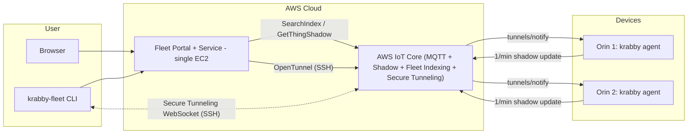
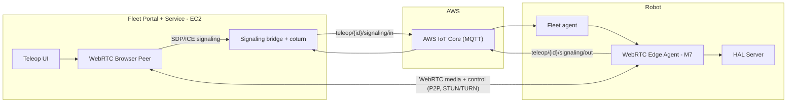

# Milestone 10 – Fleet Manager (Overview)

## Grant Overview

Build a **fleet manager** for Krab robots so we can operate and maintain many Seeed Robotics J4012 Orin Jetsons from a single web portal. The fleet manager is built on **one always-on internet channel per krab — AWS IoT Core (MQTT)** — and must support:

- **Onboarding:** a fresh Orin runs `krabby enroll` once; it provisions the device's AWS IoT identity (X.509 cert), enables `krabby agent` (the always-on MQTT client), and auto-connects to AWS IoT Core.
- **Web portal + `krabby-fleet` CLI:** list devices, see per-device 1/min telemetry, open a WebRTC teleop session (M7 teleop UI absorbed here), and open a shell — from any operator laptop, no router port forwarding on the device network.
- **Remote SSH via AWS IoT Secure Tunneling:** the tunnel bootstraps over the device's existing MQTT connection; the operator runs a local proxy and `ssh`'s to `localhost`. Once in, image and firmware lifecycle uses the existing M14 commands (`krabby install` / `krabby update` / `krabby firmware`).

M7 remains the source of truth for HAL observations, the WebRTC streaming and control protocol, and the `InputController` command struct; M10 moves teleop's internet **signaling onto the same MQTT channel** used for fleet management.

## Why is this Important?

- **Single pane for reaching a fleet:** list devices, see status and telemetry, open teleop, and get a shell — from one authenticated place.
- **Stupid-simple, robust transport:** every krab holds one outbound TLS/MQTT connection to a managed broker. Teleop signaling and SSH-tunnel bootstrap ride the same connection — the modern, managed equivalent of the old "reverse tunnel to a bastion," with NAT traversal and reconnect handled for us and nothing to self-host for the broker itself.
- **Image lifecycle stays with M14:** operators SSH in and run `krabby install` / `krabby update`, the same on-device CLI a kit owner uses. A cross-fleet rollout system, if ever needed, can be built on top without changing M10's design.

## Target Devices and Scale

- **Primary device:** Seeed Robotics J4012 Orin Jetson
- **In principle:** any Linux device that can run the M14 `krabby-launcher` stack (Docker + an MQTT client).
- **Scale:** Two robots for initial validation; AWS IoT Core (Classic Shadow + Fleet Indexing) is the storage layer. Scales to thousands of devices without re-architecting.

## Initial Fleet and M15 Handoff

M10 goes live against **two named robots** on two different residential networks — neither of which will have router port-forwarding opened for this:

| # | Robot | Location | Role |
|---|-------|----------|------|
| **1** | **Bruce's bench robot** | Bruce's lab | Fixed-location bench robot — primary target for dev, and the CI hardware target: every M10 build runs the E2E integration tests against this bench (see each task's test AC). |
| **2** | **Rabby v0.2** | Fletcher's garage | Real hexapod in a real environment — primary test robot to ensure milestone is successful. |

**End-to-end acceptance for the milestone as a whole:** from an operator laptop anywhere on the internet, with the **fleet-management CLI** (`krabby-fleet`) installed and Cognito-authenticated, Fletcher **or** Bruce can:

1. `krabby-fleet list` — see both robots and their online/last-seen + latest 1/min telemetry.
2. `krabby-fleet teleop <robot>` — open a WebRTC teleop session into either robot (browser launched by the CLI; Bluetooth gamepad drives the robot; live streams + pose).
3. `krabby-fleet ssh <robot>` — get a shell on either robot over AWS IoT Secure Tunneling. From that shell, existing M14 commands do image and firmware work.

If teleop or SSH is not reliable against both of these specific robots over the public internet, M10 is not accepted.

**Immediate consumer — M15:** James and Nick pick up as soon M10 ships and use the fleet CLI as their entry point to the [M15 sim-to-real gap analysis](../Milestone15-Sim2Real-Krab/OVERVIEW.md).

## Tasks

Total: ~3–4 weeks (one developer part-time with AI assistance). Tasks map directly to the three capabilities above; each task ships with a CI-wired E2E integration test that runs against Bruce's bench Krabby on every build and covers its happy path plus at least one auth/isolation negative case.

| Task | Summary | Doc |
|------|---------|-----|
| **Task 1** | **Control plane + onboarding.** IoT Core CDK (thing type, per-thing least-privilege policy, Classic Shadow, Fleet Indexing, presence). `krabby enroll` + `krabby agent` added to `krabby-launcher`. | [TASK-1-CONTROL-PLANE-AND-ONBOARDING.md](TASK-1-CONTROL-PLANE-AND-ONBOARDING.md) |
| **Task 2** | **Fleet service + web portal + `krabby-fleet` CLI.** Thin auth-proxy fleet service on a single EC2 (REST API backed by `iot:SearchIndex` / `iot:GetThingShadow` / `iot:OpenTunnel`). Next.js portal. `krabby-fleet` CLI (`list` / `teleop` / `ssh`) as the operator entry point. Cognito auth. | [TASK-2-FLEET-PORTAL-SERVICE.md](TASK-2-FLEET-PORTAL-SERVICE.md) |
| **Task 3** | **Teleop over the shared channel.** WebRTC teleop from the portal, signaling bridged through IoT topics, coturn (TURN) on the EC2, 2-robot demo. Reuses the M7 agent and protocol. | [TASK-3-TELEOP-INTEGRATION.md](TASK-3-TELEOP-INTEGRATION.md) |

## Dependencies

- **M7 complete:** HAL observations and sensor list, WebRTC streaming agent, control protocol (`InputController` command struct). M10 reuses the M7 WebRTC agent and adds an MQTT signaling transport alongside M7's existing WebSocket path (which remains valid for LAN/direct use).
- **M14 shipped:** the `krabby-launcher` PyPI package with the `krabby` command (`install` / `update` / `run` / `firmware`), plus `krabby-firmware` (S3 flash) and `krabby-bench` (poll-and-validate watchdog).
- **AWS account:** Krabby Co (krabby-company, account 6329-1496-1627). AWS IoT Core (things, per-thing policies, Classic Shadow as the "latest state per device" store, Fleet Indexing to query it, Secure Tunneling), one EC2 instance (fleet service + portal + coturn), Cognito, IAM.
- **Infra as code:** CDK for repeatable infra; document what must exist before starting.

## Information

- **App image:** the standard M14 production image from ECR — HAL server/clients, model, ZMQ bus, and the teleop/WebRTC agent. Installed/updated by `krabby install` / `krabby update`.
- **Agent:** `krabby-launcher` running as `krabby agent` (a systemd service), owning the device's MQTT connection. It (1) writes 1/min health telemetry into `state.reported` on the device's Classic Shadow (`$aws/things/{thingName}/shadow/update`), (2) carries teleop signaling to the M7 WebRTC agent, and (3) on a Secure Tunneling notification, spawns the AWS-provided `localproxy` in destination mode against `localhost:22` (proxy exits when the tunnel closes).
- **Stack:** AWS IoT Core (MQTT + Classic Shadow + Fleet Indexing + Secure Tunneling), EC2, Cognito; Next.js portal; WebRTC (M7 protocol) for teleop media; coturn for TURN.

### Data and access channels

| Channel | Purpose | When / rate |
|--------|---------|-------------|
| **AWS IoT Classic Shadow** — `$aws/things/{id}/shadow/update` | Portal telemetry (health, IMU/pose, power, red flags, `reported_image`) written into `state.reported`; portal reads via Fleet Indexing / `GetThingShadow`. | 1/min per robot |
| **AWS IoT Core (MQTT)** — `teleop/{id}/signaling/*` | WebRTC SDP/ICE signaling | While a teleop session is starting |
| **AWS IoT Secure Tunneling** | Operator SSH sessions (bidirectional TCP tunnel; `localproxy` on both ends, `localhost:22` on device) | While a tunnel is open |
| **WebRTC (P2P, STUN/TURN)** | Live camera streams, pose, and 50 Hz control | While a teleop session is active |

## Security

- **Portal + CLI auth:** Cognito for authentication/authorization; the fleet service mints short-lived credentials for the operator's browser or CLI on each request. Device credentials never leave the device.
- **Device identity:** each device gets a unique X.509 certificate and a scoped IoT policy (provisioned by `krabby enroll`) that lets it connect only as its own thing and publish/subscribe only on its own topics (its Classic Shadow update topic, `teleop/{id}/signaling/*`, and its Secure Tunneling notify topic). A compromised device cannot read or open tunnels to other devices.

## Repos and Artifacts

- **Code:** `krabby-home/fleet` (fleet service, portal, `krabby-fleet` CLI, CDK infra). Device-side `krabby enroll` + `krabby agent` land in the `krabby-launcher` package (`krabby-research`).
- **Grant docs (this spec):** [Milestone10-Fleet-Manager on GitHub](https://github.com/flliver/patina-foundation-grants/tree/main/grants/Krabby-Uno/Milestone10-Fleet-Manager).
- **Contract (ICA):** [krabby-contracts/milestones/M10/M10.md](https://github.com/flliver/krabby-contracts/blob/main/milestones/M10/M10.md).

## FAQ

- **What changed from the original (Greengrass-based) M10?**
  The original M10 was built around **AWS IoT Greengrass** with a `krabby-bootstrap` component that pushed images to devices, plus a staged rollout system. Two things happened: (1) M14 shipped `krabby install` / `krabby update` / `krabby firmware` and absorbed on-device image and firmware lifecycle; (2) for a two-robot dev fleet, cloud-driven rollout was cut from M10 scope in favor of "SSH in and run `krabby update`." What remains in M10 is enroll, one MQTT connection per device, 1/min telemetry, portal + CLI, WebRTC teleop, and Secure Tunneling for SSH — all sharing that one channel.

- **How does remote SSH work without port forwarding?**
  The operator runs `krabby-fleet ssh <robot>` (or hits "Open SSH" in the portal). The fleet service calls Secure Tunneling `OpenTunnel`, gets back a source + destination token, and AWS delivers the destination token to the device on the reserved `$aws/things/{thingName}/tunnels/notify` topic (the device's IoT policy allows this topic; see Task 1). `krabby agent` starts the AWS-provided `localproxy` in destination mode against `localhost:22`. The CLI runs `localproxy` in source mode locally, exposes a local port, and `exec`s `ssh operator@localhost -p <port>`. The device never opens an inbound port; the tunnel bootstraps over the same outbound MQTT connection the agent already holds.

## Architecture Diagrams

### Fleet management flow

### Teleop flow (M7 protocol, signaling over MQTT)

