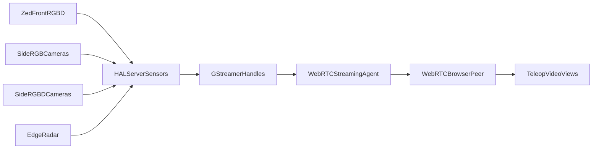

# Patina Foundation Grant - Krabby-Uno Milestone 7: Vision Integration

## Grant Overview
Integrate a front ZED 2i stereo camera and new side/rear vision sensors into Krabby's HAL stack for both local image access (on-robot models) and remote streaming (WebRTC teleoperation). Extend HAL observations and streaming to support four sensor implementations—front ZED RGB-D, side RGB cameras, side RGB-D cameras, and low-power radar—behind a common HAL sensor interface. Build a GStreamer-based multi-sensor interface, implement data collection for training pipelines, and enable remote teleoperation with video feeds and joystick control over WebRTC. All components work with both Jetson (real hardware) and IsaacSim (synthetic sensors).

## Why is this Important?
- Establishes the vision pipeline foundation: cameras → HAL → client, so downstream models (navigation, VLMs) can consume images by simply fetching from HAL observations.
- Enables remote teleoperation with live camera feeds: operators view WebRTC streams while controlling the robot from anywhere.
- Provides data collection infrastructure for training future perception/navigation models from real-world robot experience.
- Validates multi-camera bandwidth, encoding, and streaming before adding compute-heavy inference.
- Keeps the stack ROS-free while still enabling ROSBAG2 format for data portability with the broader robotics ecosystem.

## Tasks
Total: ~1 month (1 week per task, ~5 part-time working days each).

### Task 1 - Front ZED 2i HAL integration (RGB + Depth observations)
#### Narrative
Extend the HAL server and client to support camera observations using the front ZED 2i RGB-D camera as the reference implementation. On Jetson, integrate ZED SDK to capture RGB and depth frames from the front ZED 2i camera and populate new image fields in `KrabbyHardwareObservations`. On Isaac, configure a synthetic front camera in the sim scene roughly matching the Zed and wire it through the Isaac HAL server. HAL clients should be able to fetch the current RGB and/or depth frame via the standard observations interface, enabling on-robot models to access camera data without special plumbing.

This task includes: ZED SDK installation and configuration on Jetson, camera config (resolution, fps, depth mode), extending the observations struct, updating both HAL servers (Jetson and Isaac), updating the HAL client to receive/expose images, and validation scripts that display what the camera sees. This task establishes the template for how other vision sensors (side RGB, side RGB-D, radar visualization) will appear in HAL observations.
#### Acceptance Criteria
- `KrabbyHardwareObservations` extended with `camera_rgb` and `camera_depth` fields (single camera); documented format (resolution, encoding, timestamp).
- Jetson HAL server: ZED SDK integrated, captures RGB + depth at 15+ Hz, populates observation fields; 5-minute stability run without dropped frames.
- Isaac HAL server: synthetic camera added to sim scene matching real camera position/FOV, populates same observation fields.
- HAL client: `get_observations()` returns image data; example script displays RGB and depth frames from both Jetson and Isaac backends.
- `SETUP.md`: ZED SDK install, camera config, udev rules, troubleshooting; Isaac camera setup documented.
- Unit tests for observation serialization/deserialization with image data; 80%+ coverage on new code.
#### Time estimate (~5 days)
| Days | Sub-task title |
|------|----------------|
| 1 | ZED SDK install on Jetson, udev, basic capture test |
| 1–2 | Extend `HardwareObservations` with `camera_rgb` / `camera_depth`; Jetson HAL server populates from ZED |
| 1 | Isaac synthetic front camera in sim, same observation fields |
| 1 | HAL client image exposure, validation script (display RGB/depth from both backends) |
| 0.5 | SETUP.md, unit tests (serialization/deserialization, coverage) |

### Task 2 - GStreamer multi-sensor interface (ZED front, RGB, RGB-D, radar)
#### Narrative
Define a GStreamer-based sensor interface in HAL that supports multiple heterogeneous sensors: the front ZED 2i RGB-D camera, side RGB cameras, side RGB-D cameras, and low-power radar sensors. The interface should allow clients to: (1) list available sensors, (2) request a GStreamer handle for a specific sensor, and (3) generate a GStreamer pipeline that outputs an encoded video or visualization stream for that sensor. This abstracts sensor access so the same interface works with Jetson (real ZED/RGB/RGB-D/radar hardware) or Isaac (synthetic sensors rendered to GStreamer-compatible buffers).

This task includes: designing the sensor listing API, implementing GStreamer pipeline generation for ZED SDK sources (with Jetson HW encoding via nvenc), implementing equivalent pipeline generation for side RGB/RGB-D cameras and radar visualization streams, implementing equivalent pipeline generation for Isaac synthetic sensors, handling multi-sensor USB/bus bandwidth on Jetson (resolution/fps tradeoffs, hub assignments), and validation that the configured sensor set can stream simultaneously within bandwidth and power budgets. The ZED implementation in `krabby-research/hal/server/jetson/camera.py` is the reference pattern for adding other sensor backends.
#### Acceptance Criteria
- New HAL sensor interface: `list_sensors()` returns available sensors with metadata (id, type, pose, modality, resolution, fps); `get_gstreamer_handle(sensor_id)` returns a handle for pipeline construction.
- `build_pipeline(handle, encoding='h264')` (or equivalent) returns a GStreamer pipeline string that outputs an encoded stream; works for both Jetson (ZED/RGB/RGB-D/radar + nvenc where applicable) and Isaac (synthetic sensors + software encode).
- Jetson: configured front ZED 2i, side RGB/RGB-D cameras, and radar sensors can stream simultaneously at target frame rates with documented USB/bus and power tradeoffs.
- Isaac: synthetic equivalents for these sensors are configured in sim, each produces a stream via the same interface; sensor poses match real hardware layout.
- Example script: lists sensors, generates pipelines for all configured sensors, launches them, and displays decoded output in a grid (or separate panes); works on both backends.
- Documentation: sensor interface API, pipeline generation options, multi-sensor bandwidth/power considerations, Isaac sensor setup, and how new sensor backends plug into the interface.
#### Time estimate (~5 days)
| Days | Sub-task title |
|------|----------------|
| 1 | Sensor listing API design and `SensorInfo`/handle types; `list_sensors()`, `get_gstreamer_handle(sensor_id)` |
| 1–2 | GStreamer pipeline generation for ZED (nvenc); `build_pipeline(handle, encoding='h264')` |
| 1 | Side RGB + RGB-D + radar backend stubs; pipeline generation for each (reuse `hal/server/jetson/camera.py` pattern) |
| 1 | Isaac synthetic sensors for all four types, same interface |
| 0.5–1 | Multi-stream validation script (grid display), bandwidth/power notes in docs |

### Task 3 - Data collection agent (ROSBAG2 recording)
#### Narrative
Build a data collection agent that runs inside existing Isaac/Jetson Docker container, connects to the HAL client, pulls image and radar observations (and optionally joint states, IMU, commands), and writes them to ROSBAG2 format on the device. The agent should rotate bag files every X minutes, and clean up oldest files when approaching a configured max size (default: 50% of Orin disk space), ensuring continuous recording without filling the disk. This enables collecting training data from real-world robot operation for future perception/navigation model training.

This task includes: Docker image setup with ROSBAG2 dependencies (without full ROS install if possible, or minimal ROS for mcap/rosbag2 libraries), HAL client integration for pulling observations at configurable rate, ROSBAG2 writer with configurable topics (images, joints, IMU, commands), disk space monitoring and automatic rotation, and validation on both Jetson and Isaac backends.
#### Acceptance Criteria
- Docker image (`krabby-data-collector`) with ROSBAG2 writing capability; documented Dockerfile and build instructions.
- Agent connects to HAL client, pulls observations at configurable rate (default 10 Hz for images, 50 Hz for joints/IMU).
- Writes to ROSBAG2 format (mcap) from configurable topics; default includes: `/camera/front/rgb`, `/camera/front/depth`, `/camera/side_left/rgb`, `/camera/side_right/rgb`, `/camera/side_rgbd/depth` (if present), `/radar/edge` (if present), `/joints/state`, `/joints/command`, `/imu`. All sensors should go into one rosbag for ease of viewing the whole robot observation for a given time at once using a ROSbag viewer.
- Disk monitoring: rotates to new bag file when current exceeds configured size; default max total usage is 50% of disk; oldest bags deleted when limit reached.
- Config file (YAML) for: HAL server address, recording rate, topics, max disk usage, bag rotation size.
- Works with Jetson (real cameras) and Isaac (synthetic); 30-minute recording test on each without disk overflow or dropped frames.
- Playback validation: recorded bags can be read with standard ROSBAG2 tools; example script replays and displays recorded images.
#### Time estimate (~2 days)
| Days | Sub-task title |
|------|----------------|
| 1 | Agent: connect to HAL client, pull observations and dump to mcap |
| 0.5 | Disk monitoring: max usage 50%, rotate + delete oldest |
| 0.5 | Validation: 30-min record on Jetson/Isaac; implement agent startup/record/stop/validate integ tests. |

### Task 4 - WebRTC streaming agent
#### Narrative
Build a WebRTC agent that runs on the Jetson (or Isaac host), connects to a remote server app via URL, and establishes WebRTC connections to stream vision/radar feeds as requested by the server. The server app controls which sensors to stream and at what quality using standard webRTC congestion control features (nothing special to be added here); the agent responds to these requests and maintains the WebRTC connections. This enables remote operators to view live camera and radar visualizations from anywhere with internet access.

This task includes: WebRTC client implementation (using aiortc or GStreamer webrtcbin, provide some verbal reasoning as to which we should pick after you have time to review), teleop instantiation between web client and robot, dynamic stream management (server can request/release individual sensor streams), H.264 encoding pipeline integration (reuse Task 2 GStreamer handles), and validation with the web app requesting 1, 2, all sensors.
#### Acceptance Criteria
- WebRTC agent runs as a service on Jetson Docker image; connects to configurable server URL on startup.
- Teleop instantiation: Lets review options for how we can do a P2P webRTC connection after you have had some chance to research, the simplest is that the webRTC broswer plugin will be handed a public IP + port, utilize standard port forwarding, and the robot will be listening on that port and do auth/authz w/ the browser/webRTC connection. The ideal is that Robot and Web Server can both hit some broker, and broker can enable P2P (think limewire style) between the two hosts w/o either of them needing a public/static IP/DNS. Let me know what you think best/simplest options are there.
- Latency: <300ms glass-to-glass for single stream; <500ms for 4 streams; documented measurement method.
- Test server app (Python/Node): accepts agent connections, provides UI to request/view streams, displays latency stats.
- Works with Jetson (real cameras) and Isaac (synthetic); 10-minute streaming test on each without disconnects.
- Has reasonable degradation and QoS when insufficient bandwidth to stream all streams
- Documentation: signaling protocol spec, agent config, server app setup, firewall/NAT considerations.
#### Time estimate (~8 days)
| Days | Sub-task title |
|------|----------------|
| 0.5 | Choose stack (aiortc vs webrtcbin); teleop instantiation design (see acceptance criteria: P2P options) |
| 1 | WebRTC agent: connect to server URL, signaling, request/release sensor streams |
| 1 | Wire Task 2 GStreamer handles into agent; H.264 over WebRTC to browser |
| 2 | Test web app: request 1 / 2 / all sensors, show streams and latency stats |
| 2 | Extend over internet w/ P2P or static IP routing solution; 10-min stability test Jetson + Isaac |
| 1 | Full integ test, standup local website, connect to edge docker image running sim, test stream, validate

### Task 5 - WebRTC joystick teleoperation (WebRTCInputController)
#### Narrative
Extend the WebRTC connection to support bidirectional control: the server app sends joystick/gamepad commands down to the robot, and a new `WebRTCInputController` receives these commands and feeds them into the ControlLoop (same interface as the local `InputController` from M6). This enables full remote teleoperation: operator views camera/radar feeds and controls the robot from a browser, with commands flowing over the same WebRTC connection as the video (on a separate webRTC data channel, webRTC has support for this built in).

This task includes: extending the signaling/data channel protocol for control commands, implementing `WebRTCInputController` that mirrors the `InputController` interface, wiring it into ControlLoop as an alternative input source, server app UI for gamepad input (browser Gamepad API or virtual joystick), and end-to-end validation with remote operator driving the robot while viewing sensor streams. The existing Python `InputController` + `ControlLoop` path is the reference design for the JS-based controller client that runs in the TeleOps WebRTC widget.
#### Acceptance Criteria
- WebRTC data channel added for control commands; protocol supports the same command struct as local `InputController` (leg selection, hip/knee/yaw axes).
- `WebRTCInputController` implements same interface as `InputController`; can be selected in ControlLoop config (`--controller webrtc`).
- Server app: captures gamepad input (browser Gamepad API) or provides virtual joystick UI; sends commands over WebRTC data channel at 50+ Hz.
- Command latency: <100ms from server input to robot HAL command; documented measurement.
- End-to-end test: operator on remote machine views 4+ sensor streams (cameras/radar visualizations) and drives robot via browser gamepad; robot responds to commands; 5-minute session without disconnects.
- Works with Jetson (real robot) and Isaac (sim); video capture of remote teleoperation session on each.
- Documentation: control protocol spec, server app gamepad setup, ControlLoop config for WebRTC input, latency tuning.
#### Time estimate (~3 days)
| Days | Sub-task title |
|------|----------------|
| 0.5 | Data channel protocol for control (same struct as `InputController`); spec doc |
| 1 | `WebRTCInputController` impl, same interface as `InputController`; wire into ControlLoop (`--controller webrtc`) |
| 1 | Web Server app: Gamepad API or virtual joystick, send commands at 50+ Hz over data channel (exact same as existing python inputcontroller but in JS) |
| 0.5 | End-to-end integ test (simulated controller is fine) |

## Information
- Hardware: ZED 2i stereo camera (front), side/rear RGB and/or RGB-D cameras, low-power radar for edge sensing, Jetson Orin, USB 3.0 hubs (for multi-sensor bandwidth).
- SDK: ZED SDK for Jetson; Python bindings (`pyzed`).
- Streaming: GStreamer with nvenc (Jetson HW encoder); aiortc or webrtcbin for WebRTC.
- Data format: ROSBAG2 (mcap) for data collection; enables compatibility with ROS ecosystem tools without running ROS.
- HAL: extend `krabby-research/hal/` for image observations and sensor interface.
- Isaac: synthetic cameras configured to match real camera positions/FOV; same HAL interface for both backends.

### Side/rear sensor choices
There are two deployment options for side and rear sensing, I haven't decided which one to go with and want to see them both in action:

**Option A – Cheaper RGB-D for side/rear**
- **Pick: DFRobot CS30** — RGB-D ToF, 5 m range, 1080p color + 640×480 depth, 100°×75° FOV, USB 2.0 Type-C, Linux/ROS, ~3 W.
- **Price:** ~\$299 (slightly above \$200; no robust 8 m RGB-D under \$200 found).
- **Rationale:** Best balance of range (5 m), RGB+depth, wide FOV, and Linux/ROS support in the sub-\$300 space. If strict \<\$200 is required, **DFRobot CS20** (\$160) is depth-only 5 m; pair with an ELP 3MP RGB for color.
  Other viable RGB-D families, depending on budget and availability:
  - **Orbbec Astra 2** — structured-light RGB-D, ~0.6–8 m depth range, ~\$350, USB 3.0, Orbbec SDK with Linux support; primarily specified for indoor use.
  - **Orbbec Gemini 2 / Gemini 2 XL** — stereo depth; Gemini 2 (~\$230) as a lower-cost option, Gemini 2 XL (~\$450, 0.4–20 m) as a long-range option if we later decide to spend more for range.
  - **Intel RealSense D435i / D455** — well-known stereo RGB-D cameras with Linux `librealsense` support; D435i (~\$330, ~0.3–3 m) and D455 (~\$420, ~0.6–6 m, up to ~20 m max) are both reasonable side/rear candidates, and super common in research, but are older and I'm not seeing alot of investment from Intel in the space.
  - **E-con DepthVista (ToF)** — premium Jetson/ROS2-friendly ToF RGB-D camera (~\$1k class) with ~1–6 m (up to ~8.5 m in some configs); better treated as a higher-end option if we later want tighter Jetson integration rather than the first, budget choice. Way too expensive though.

**Option B – Inexpensive 3 MP RGB + low-power radar**
- **RGB: ELP 3MP UVC USB camera** — e.g. 2.1 mm wide-angle or 180° lens, WDR 100 dB, H.264/MJPEG, driverless UVC.
- **Price:** ~\$64–74.
- **Rationale:** Meets ≥3 MP, outdoor-friendly WDR, wide FOV, Linux plug-and-play; multiple vendors (e.g. webcamerausb.com, Arducam/SVPRO variants).
- **Radar: Acconeer XM125** — e.g. SparkFun Qwiic breakout or equivalent; 60 GHz pulsed coherent, USB via serial.
- **Price:** ~\$75–100 (breakout-dependent).
- **Rationale:** Very low power (mW range, well under 5–6 W); 7 m presence detection (up to ~20 m with lens); Linux support (e.g. Acconeer Exploration Tool, `/dev/ttyUSB`); good for edge/side obstacle detection.

| Role | Option A (RGB-D) | Option B (RGB + radar) |
|------|------------------|------------------------|
| Side/rear depth/range | DFRobot CS30 (5 m) or CS20 + ELP RGB | — |
| Side/rear RGB | (included in CS30) | ELP 3MP wide-angle (~\$65) |
| Edge/side range | — | Acconeer XM125 (~\$75–100) |

Exact part numbers and vendor links can be added once purchase orders are decided (e.g. ELP model number, SparkFun vs other XM125 breakout).

## FAQ
- **Why ROSBAG2 without ROS?**  
  ROSBAG2 uses mcap format which can be written/read without a full ROS install. This gives data portability with the ROS ecosystem for training pipelines while keeping the runtime stack ROS-free.
- **How does the server app work?**  
  The server app is a simple web application that the WebRTC agent connects to. It handles signaling, displays video streams, and captures gamepad input. It can run on any host with internet access. It will eventually run on EC2, but for now keep it simple, an app accepting basic HTTPS on a configured port to get webRTC over a second port.
- **Can I test without 4 cameras?**  
  Yes. The interface supports 1–4 cameras; start with 1-2 for development, scale to 4-8 for full validation.
- **How do on-robot models get images?**  
  Via HAL observations (`get_observations().camera_rgb`). The GStreamer/WebRTC path is for remote viewing; HAL observations are for local inference.
- **What about depth in WebRTC?**  
  Depth can be encoded as colorized video for visualization. Raw depth for inference should use HAL observations, not WebRTC.
- **How do I get sufficient bandwidth to test four cameras from one USB 3.0 bus?**
  Honestly you don't, at least not with 4x ZED 2i. The original 4x ZED design would require a more expensive compute box and cameras, and spend most of the compute on depth. Instead, this milestone moves to a more realistic mix: a single front ZED 2i, plus cheaper/lower-bandwidth side/rear sensors (RGB-D or RGB+radar). We'll select specific sensors and document their bandwidth and power tradeoffs, and if needed fall back to even lower-resolution monocular plus additional range sensors (e.g., dome lidar). Success of this milestone doesn't depend on going through contortions if we hit USB bandwidth limitations, we'll just turn off the side cameras or otherwise reduce bandwidth, then will probably do an M.2 -> USB root hub as an add-on task. 
- **What's the simple rundown of how to build this out step by step?**
  1. **Stand up a simple WebRTC JS widget** that connects over localhost to a **teleop agent** running in the robot-edge Docker image. The agent serves a **test stream** (e.g. "TV static" or "this is a test" from a basic in-memory GStreamer pipeline) so you see video in the widget and confirm the connection path.
  2. **Add the ZED camera to that Docker image** (extend HAL server observations as needed). Show the **live ZED feed** in the web widget via the same WebRTC path.
  3. **Add simulated cameras for ZED** in Isaac; show the **synthetic ZED** in the widget and confirm the same HAL/streaming path works in sim.
  4. **Extend for side/back sensors**: add side RGB, side RGB-D, and radar to HAL (backend + GStreamer handles). Expose them through the same sensor interface and show **all sensor streams** in the widget (Jetson and Isaac).
  5. **Add ROSBAG storage**: implement an **independent topic listener** that uses the HAL client → teleop-agent data path you already built; write observations to ROSBAG2 (mcap) with rotation and disk limits.
  6. **Add a JS InputController** in the web widget; send commands over WebRTC (data channel). On the robot, **mirror the existing HAL InputController** (Python) so the WebRTC agent receives JS commands and pushes them into the same HAL client / mapper interface.
  7. **Control the robot in simulation**: full loop—browser gamepad → WebRTC → agent → HAL client → mapper → HAL server → sim; confirm the robot moves in Isaac.
  8. **Extend to P2P over the internet**: choose and implement teleop instantiation (e.g. public IP + port + auth, or broker-based P2P). Run the teleop portal from a cloud or remote host and connect to the robot over the internet with auth/authz.
  9. Tune latency and QoS for multiple streams.
  10. Document SETUP.md and run the full test matrix (Jetson + Isaac, 1 / 2 / all sensors, local + P2P).

## Teleoperation Architecture Diagrams

```mermaid
flowchart LR
  browserController["BrowserJSController"]
  browserPeer["WebRTCBrowserPeer"]
  edgeAgent["WebRTCEdgeAgent"]
  halClient["HALClient"]
  mapper["GamepadToKrabbyHALMapper"]
  halServer["HALServer"]
  mcu["KrabbyMCU"]
  robot["RobotLegs"]

  browserController --> browserPeer
  browserPeer -->|"data channel (controls)"| edgeAgent
  edgeAgent --> halClient
  halClient --> mapper
  mapper --> halServer
  halServer --> mcu
  mcu --> robot
```

